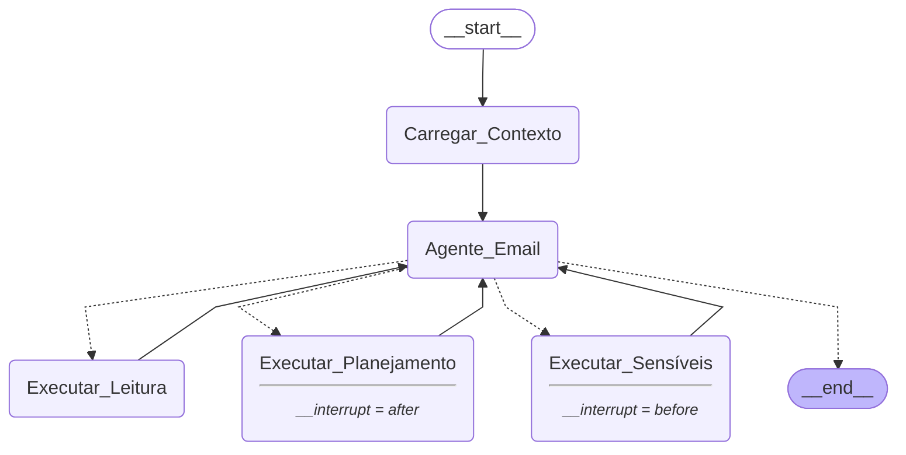

```mermaid
---
config:
  flowchart:
    curve: linear
---
graph TD;
	__start__([<p>__start__</p>]):::first
	Carregar_Contexto(Carregar_Contexto)
	Agente_Email(Agente_Email)
	Executar_Leitura(Executar_Leitura)
	Executar_Planejamento(Executar_Planejamento<hr/><small><em>__interrupt = after</em></small>)
	Executar_Sens\edveis(Executar_Sensíveis<hr/><small><em>__interrupt = before</em></small>)
	__end__([<p>__end__</p>]):::last
	Agente_Email -.-> Executar_Leitura;
	Agente_Email -.-> Executar_Planejamento;
	Agente_Email -.-> Executar_Sens\edveis;
	Agente_Email -.-> __end__;
	Carregar_Contexto --> Agente_Email;
	Executar_Leitura --> Agente_Email;
	Executar_Planejamento --> Agente_Email;
	Executar_Sens\edveis --> Agente_Email;
	__start__ --> Carregar_Contexto;
	classDef default fill:#f2f0ff,line-height:1.2
	classDef first fill-opacity:0
	classDef last fill:#bfb6fc

```